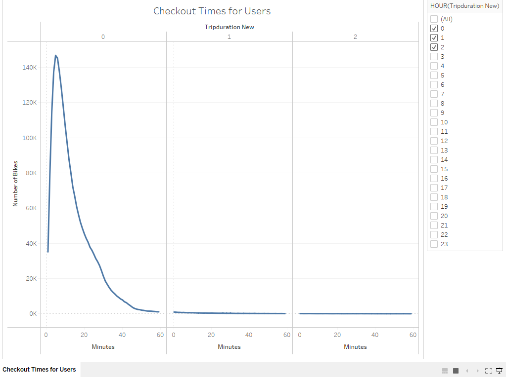

# bikesharing
Analysis of Citi bike using Tableau

## Overview of Analysis

The goal of the analysis is to convince our investors that a bike sharing program is a solid business proposal. An analysis is carried out on an existing bike data from New York city company Citibike to figure out how the bike sharing works and show the profitability of a bike sharing business.

## Result of Analysis

### Checkout time of users

[Link to NYC Tableau story](https://public.tableau.com/app/profile/akanksha.lamba/viz/NYCCitibikeAnalysis_16704632563000/NYCCitibikeAnalysis)

